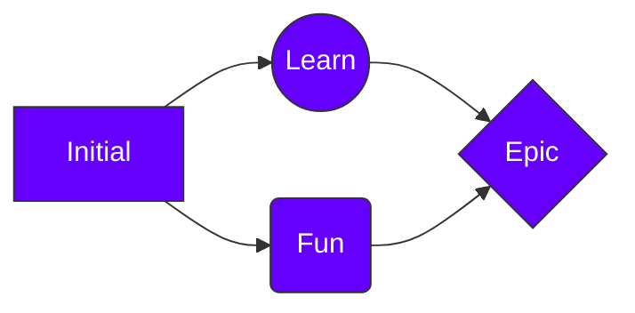

### Hi there !

I'm Tanesh,
- A software developer,
- An avid learner,
- Would love to connect.

&nbsp;

My interests include
- Psychology
- Reading
- Social Engineering
- Learning
- Coding

&nbsp;

### My philosophy includes

&nbsp;

&nbsp;

&nbsp;

